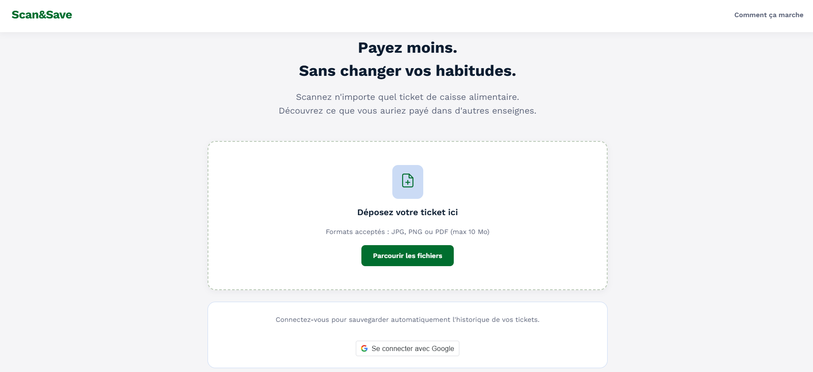
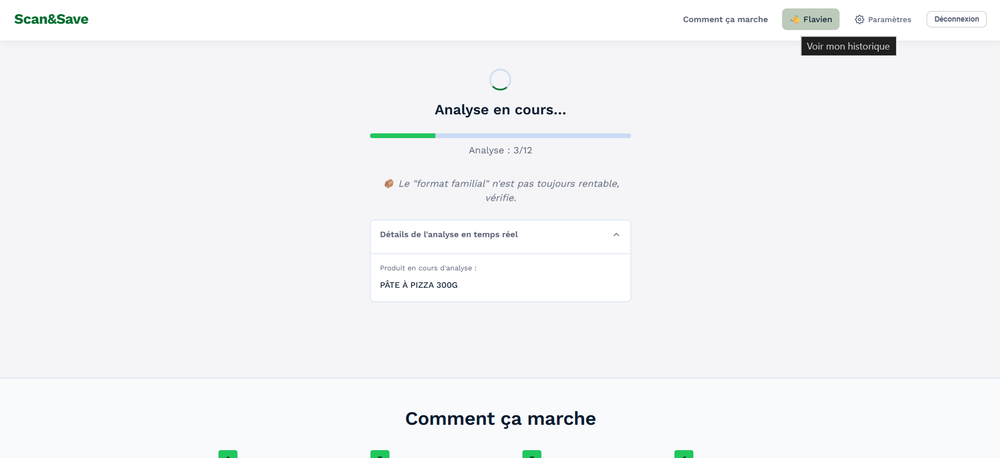
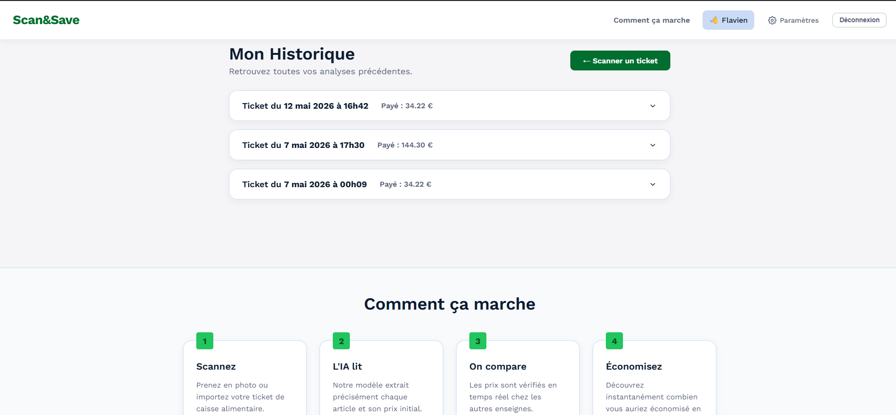

# Scan&Save

Application web permettant d’analyser un ticket de caisse et de comparer automatiquement les prix des produits dans d’autres enseignes.


-----

## Aperçu





-----

## Fonctionnement

1. L’utilisateur importe une photo de son ticket de caisse.
1. Un modèle vision-language (Groq / Llama) extrait les produits et leurs prix.
1. Des scrapers et appels API recherchent les prix équivalents chez les concurrents.
1. Les résultats sont affichés dans un tableau comparatif avec les économies potentielles.

-----

## Fonctionnalités

- Extraction des produits et prix via modèle IA multimodal (gestion des abréviations)
- Comparaison en temps réel : Carrefour (simulation navigateur), Monoprix (API)
- Tableau de résultats avec prix éditables et recalcul instantané
- Historique paginé des analyses

-----

## Stack technique

- **Node.js / Express** — serveur et API
- **MongoDB / Mongoose** — stockage des données
- **Playwright** + stealth — scraping avec contournement anti-bot
- **Groq API** (Llama 4 Scout) — inférence par défaut
- **Ollama** (Llama 3.2 Vision) — alternative locale hors-ligne
- **JavaScript Vanilla** — frontend SPA sans framework

-----

## Installation

### Prérequis

- [Node.js](https://nodejs.org/) v18+
- [Git](https://git-scm.com/)

### 1. Cloner le dépôt

```bash
git clone https://github.com/flavi1lv/ticketIA.git
cd ticketIA
```

### 2. Configuration

Renseignez le fichier `config.js` à la racine avec vos clés : Groq, Google OAuth, URI MongoDB, et choix du provider IA.

### 3. Installer les dépendances

```bash
npm install
```

### 4. Lancer le serveur

```bash
node .
```

L’application est accessible sur `http://localhost:3000`.

-----

## Structure du projet

```
helpers/        Fonctions utilitaires (normalisation, matching produit)
public/         Frontend (HTML, CSS, JS)
scrapers/       Scripts Playwright et appels API concurrents
models/         Schémas Mongoose
config.js       Configuration (clés API, provider IA)
```

-----

## Difficultés techniques

**Protection anti-bot**
Le scraping de Carrefour nécessitait Playwright en mode stealth avec blocage des ressources non essentielles pour éviter la détection.

**Correspondance des produits**
Les libellés des tickets étant souvent abrégés (ex : *FUZE T. 1.25L*), un algorithme de tokenisation a été développé dans `helpers.js` pour faire correspondre ces références avec les nomenclatures officielles.

**OCR et qualité des tickets**
Les solutions OCR classiques (Tesseract.js) donnaient de mauvais résultats sur les tickets froissés ou flous. Le projet est passé à une approche vision-language, avec un travail sur les prompts pour éviter l’auto-complétion abusive du modèle.

-----

## Limites

- Certaines enseignes modifient régulièrement leur structure HTML, ce qui peut nécessiter une mise à jour des scrapers.
- Les tickets peu lisibles ou très abîmés peuvent produire des erreurs d’extraction.
- Le matching produit reste approximatif sur certains libellés très abrégés ou ambigus.

-----

## Remarques

Ce projet est expérimental et destiné à un usage éducatif. Les requêtes sont limitées afin d’éviter une charge excessive sur les sites interrogés.
